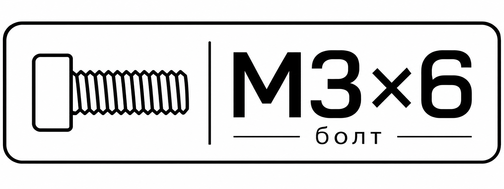

# NIIMBOT — личные наклейки

[Каталог](CATALOG.md) · [Идеи и предпочтения](CONTEXT.md) · [Подключение](CONNECTION.md) · [Журнал печати](PRINT_LOG.md)

Утверждённый шаблон всех болтов: [эталон и правила](templates/bolts/README.md). Меняется только размер; носитель одной наклейки — 40×15 мм.



Исторический макет v2 (заменён пользовательским эталоном): иллюстрация GPT Image + точная надпись Arial Bold. PNG — для импорта; файл label-v2-203dpi.png — подготовленный растр 320×120. Ранняя векторная версия сохранена только как история. Первый тест подтвердил связь по Bluetooth, но отклонён пользователем: плохое качество, смещение и пустая половина парной ленты. Повторная печать приостановлена. Установлено официальное приложение NIIMBOT 4.2.5, проверяем его.

Повторить генерацию на этом Mac (Python + Pillow, системный Arial Bold):

```sh
python3 scripts/compose_label.py
```

Исторический генератор рукотворной пиктограммы (не использовать для новых иллюстраций):

```sh
python3 scripts/render_fastener.py --text 'M3×8' --output labels/fasteners/m3x8-countersunk-black
```

После генерации добавить запись в каталог. Для другой головки или другого типа крепежа сначала подобрать/создать соответствующую пиктограмму: один шаблон не описывает все виды винтов.

Файлы сохранены локально; удалённый репозиторий пока не настроен.

Парная лента T40×15MM/2R: две половины по 40×15 мм в одной единице подачи. scripts/compose_pair.py упаковывает два готовых растра 320×120 в 320×240 без пересэмплирования; оба входа задаются явно. pair-comparison-draft.png — только кандидат для сравнения прежней иллюстрации через другой клиент, не утверждённый финальный дизайн и пока не напечатан.
